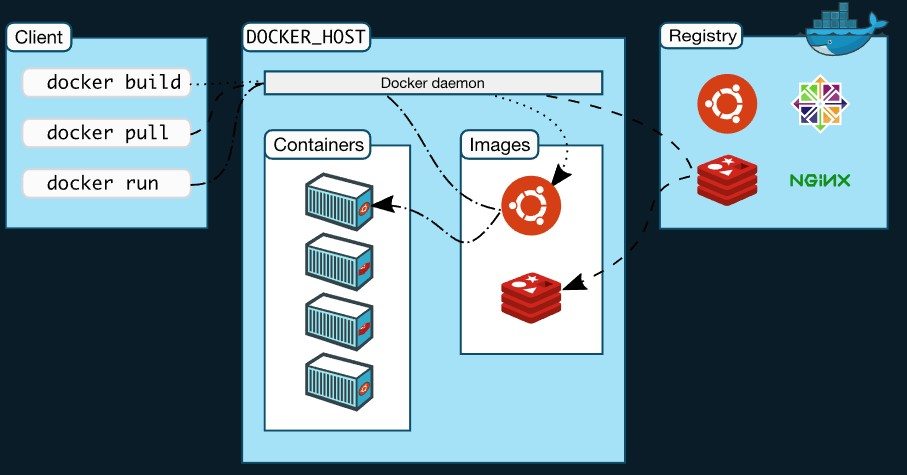

---

# Cloud Service for Container Registry

- ## 1. Docker Hub

- ## 2. Google Container Registry

---

# Deploy a registry server

```sh
# Run a local registry
docker run -d -p 5000:5000 --restart=always --name registry -v /home/evan/mnt/registry:/var/lib/registry  registry:2
```

```sh
# The first part of the tag is a hostname and port, Docker interprets this as the location of a registry, when pushing.
docker tag express-server localhost:5000/express-server
```

```sh
# Push the image to the local registry running at localhost:5000
docker push localhost:5000/express-server
```

```sh
# List images in the local registry
curl -X GET http://localhost:5000/v2/_catalog
```

# Test an insecure registry

- ## Edit the **daemon.json** file, whose default location is **/etc/docker/daemon.json** on Linux

```json
{
  "insecure-registries": ["myregistrydomain.com:5000"]
}
```
